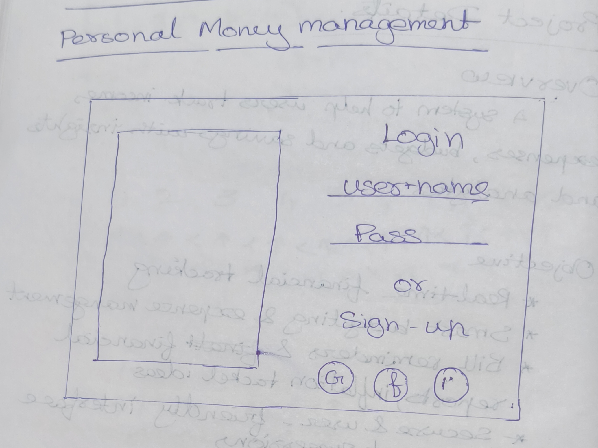
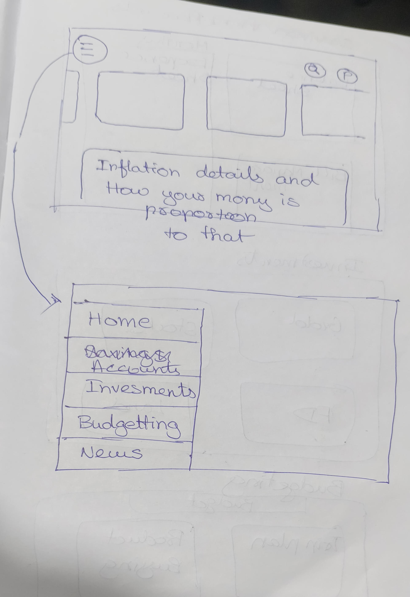
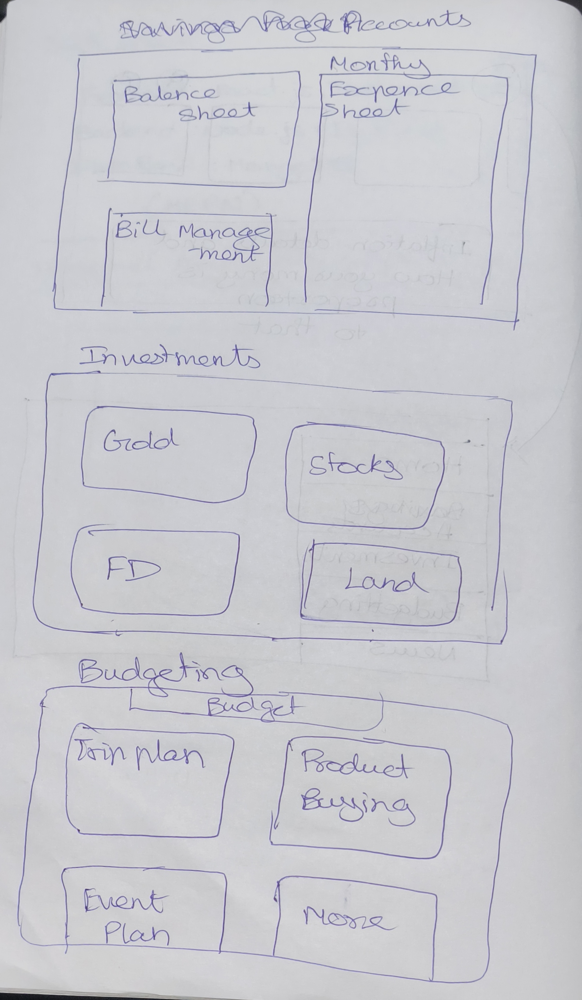

# Money Manager
## ***Personal Finance Management System***

### Overview
Money Manager is a comprehensive personal finance management system designed to help users efficiently track their income, expenses, budgets, and savings. With insightful analytics and smart financial tools, users can make informed decisions to achieve financial stability and growth.

### Objectives
- **Real-time Financial Tracking** - Monitor income and expenses with real-time updates.
- **Smart Budgeting & Expense Management** - Set budgets and receive intelligent recommendations.
- **Bill Reminders & Financial Reports** - Never miss a payment and access detailed financial summaries.
- **Secure & User-Friendly Interface** - Ensure data safety with an intuitive and seamless experience.
- **Inflation Protection Strategies** - Get personalized suggestions to minimize the impact of inflation.
- **Investment Insights** - Explore investment opportunities based on spending patterns and savings.

### Project Workflow
1. **Planning & Design**  
   - Define core features and functionalities.
   - Design an intuitive UI/UX for smooth user interaction.
2. **Backend Development**  
   - Implement APIs and authentication mechanisms.
   - Set up and optimize the database for efficient storage and retrieval.
3. **Frontend Development**  
   - Build an engaging and responsive UI.
   - Seamlessly integrate the frontend with the backend.
4. **Testing & Deployment**  
   - Conduct security and performance checks.
   - Deploy on the cloud for accessibility and scalability.

### Tech Stack
- **Frontend:** React.js, CSS for a modern and responsive UI.
- **Backend:** Node.js with Express for robust API development.
- **Database:** MongoDB for flexible and efficient data management.

## Layout Image

